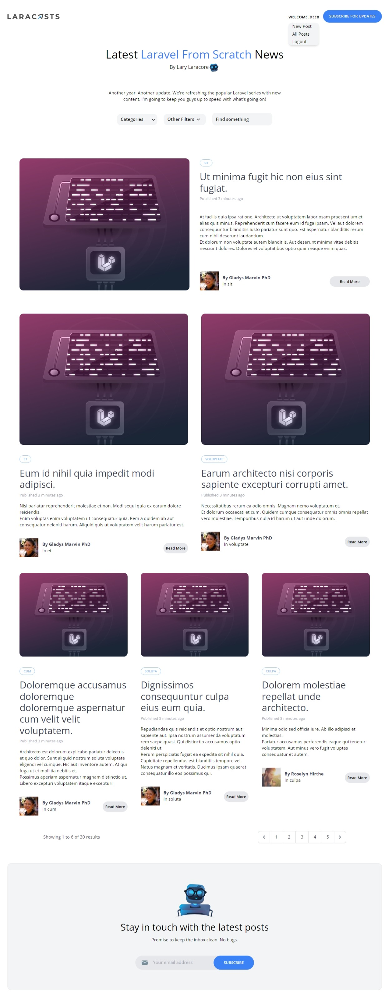
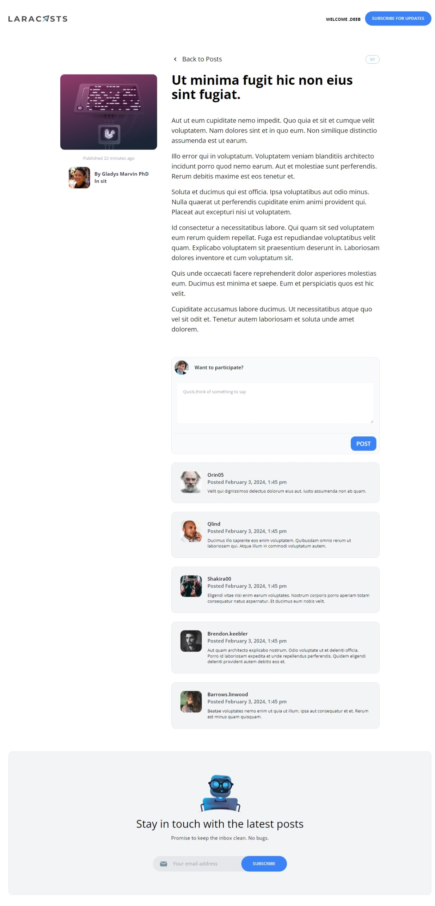
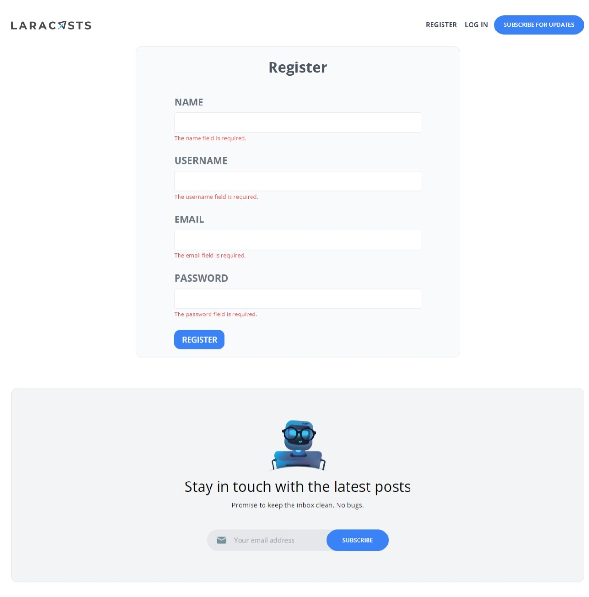
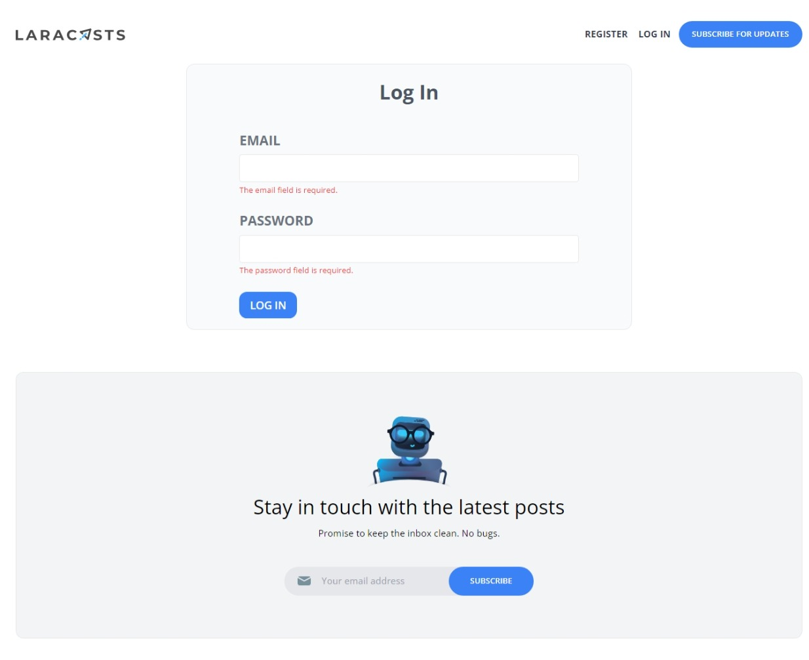
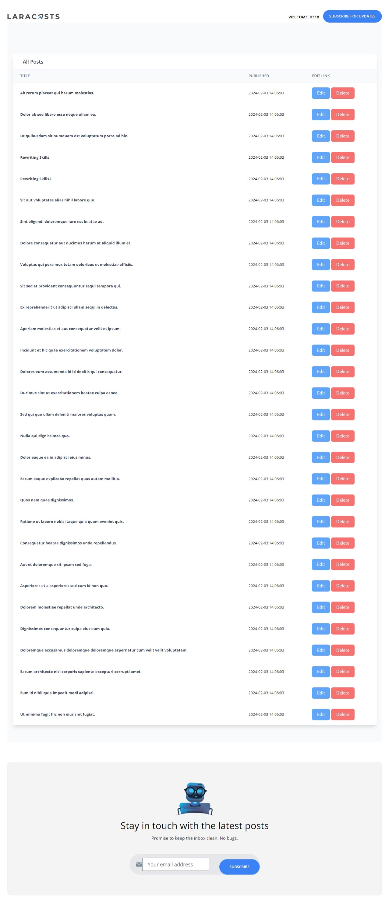
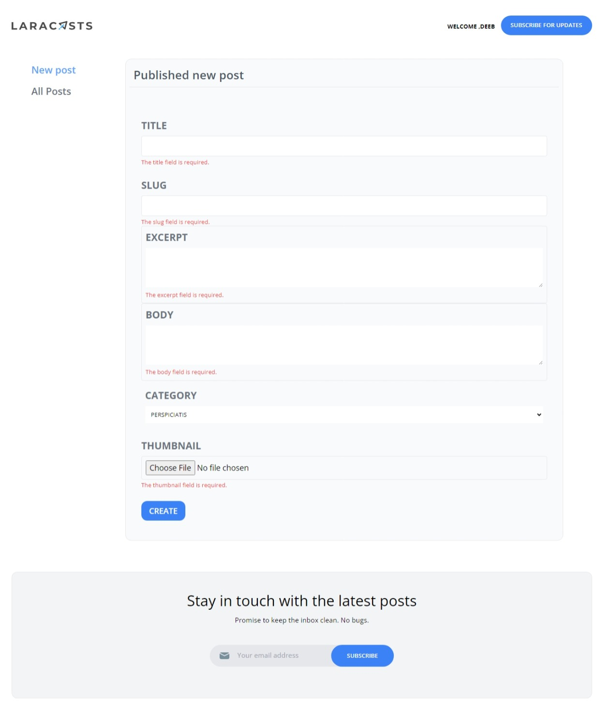

<h3>building a complete CMS Blogs Posts </h3>
<h3>Using Laravel 10 && MySQL</h3>  
<h3>And used Mailchimp newsletter service && Tailwind css && alpine components</h3>  
<h3>The home page</h3>  
 
<h3>Post details page</h3>  
 
<h3>Register page</h3>  
 
<h3>Login page</h3>  
 
<h3>Admin Show Posts page</h3>  
 
<h3>Admin Create Post page</h3>  
 

